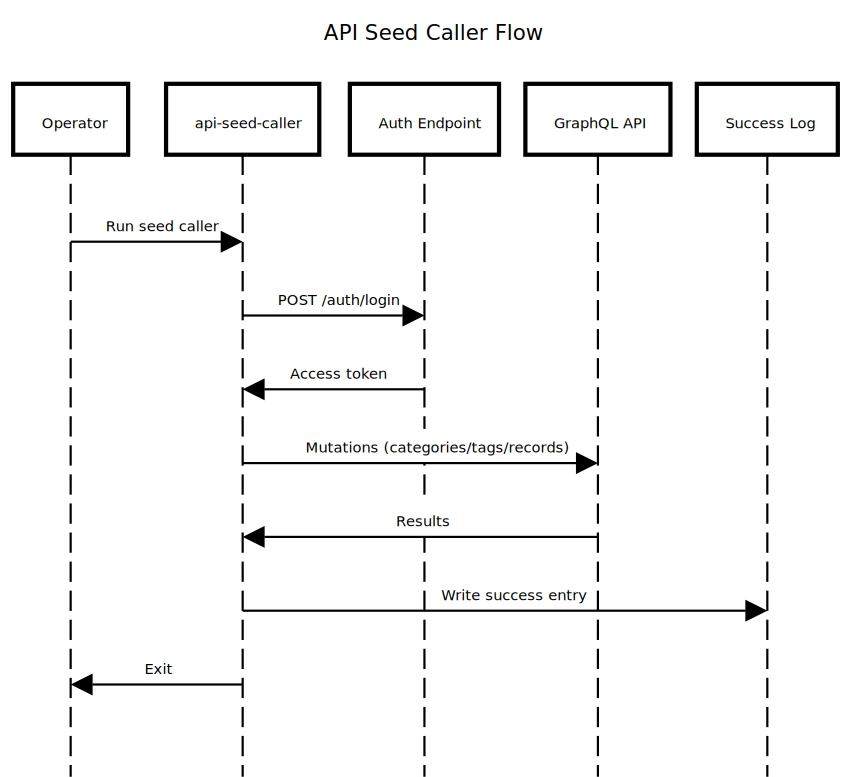

# cmd/api-seed-caller

This CLI generates authenticated API traffic to seed data and validate the end-to-end flow (login + GraphQL mutations). It is useful for observability checks and smoke tests without touching the database directly.

## Package Composition

- `main.go`
  - Wires config, runs the seed workflow, and prints results.
- Client and workflow files
  - Build HTTP requests, execute login, then seed categories/tags/records via GraphQL.

## Flow (Where it comes from -> Where it goes)

Operator -> CLI -> Auth login -> GraphQL mutations -> Success log



Diagram source: `docs/diagram/cmd-api-seed-caller.sequence.txt`

## Why It Was Designed This Way

- Seed through the same API paths used in production.
- Exercise auth, permissions, and GraphQL mapping.
- Produce telemetry (logs/metrics/traces) across real endpoints.

## Recommended Practices Visible Here

- Use configuration via environment variables.
- Prefer API calls over direct DB access for validation.
- Keep side effects explicit and traceable.

## Differentials (Rare but Valuable)

- Multi-user seeding with deterministic naming.
- Optional auto-create path for missing users.
- Optional clean mode for safe re-runs.

## Quick Run

```bash
go run ./cmd/api-seed-caller
```

## Environment Variables

| Variable | Description |
| --- | --- |
| `API_CALLER_HOST` | Base API host (default: `http://localhost:5001`) |
| `API_CALLER_CONTEXT` | Context path (default: `/aion`) |
| `API_CALLER_ROOT` | API root (default: `/api/v1`) |
| `API_CALLER_GRAPHQL` | GraphQL path (default: `/graphql`) |
| `API_CALLER_USER` | Login user (default: `user1`) |
| `API_CALLER_PASS` / `API_CALLER_PASSWORD` | Login password (default: `testpassword123`) |
| `API_CALLER_SUCCESS_LOG` | Success log file (default: `infrastructure/db/seed/api_success.log`) |
| `API_CALLER_AUTO_CREATE` | Create user when login fails (default: `false`) |
| `API_CALLER_CLEAN` | Soft delete records before seeding (default: `false`) |
| `API_CALLER_ONLY_CLEAN` | Only clean and exit (default: `false`) |
| `API_CALLER_COUNT` | Number of users to seed (default: `1`) |
| `API_CALLER_USER_PREFIX` | Username prefix (default: `user`) |
| `API_CALLER_RUN_ID` | Run identifier suffix (default: empty) |
| `API_CALLER_DEBUG` | Log GraphQL payloads (default: `false`) |
| `API_CALLER_TIMEOUT` | HTTP timeout (example: `15s`, default: `10s`) |

## Multi-User Examples

```bash
# Seed 50 users (user1..user50), auto-create missing users
API_CALLER_COUNT=50 API_CALLER_AUTO_CREATE=true go run ./cmd/api-seed-caller

# Using Makefile helper (if available)
make seed-caller N=50
```

## What It Does

1) Login via `/auth/login` and obtain a token.
2) Optionally auto-create the user if login fails.
3) Seed categories, tags, and records via GraphQL.
4) Optionally clean records (and optionally user data) before seeding.
5) Write only successful runs to the configured log.

## What Should NOT Live Here

- Domain rules or validation.
- Direct database access.
- Production-only operational logic.
