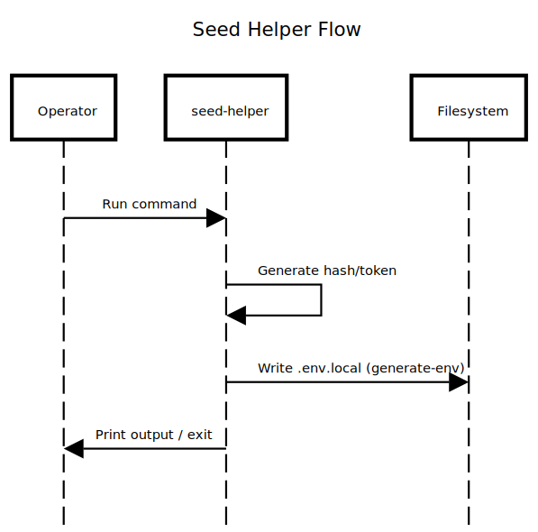

# cmd/seed-helper

This CLI generates seed credentials and auth tokens for local development. It is used by Make targets to prepare database seed variables and test tokens.

## Package Composition

- `main.go`
  - Implements the command parser and generators.
  - Writes a local seed env file and prints tokens/hashes.

## Flow (Where it comes from -> Where it goes)

Operator -> seed-helper -> generate hashes/tokens -> .env.local / stdout



Diagram source: `docs/diagram/cmd-seed-helper.sequence.txt`

## Why It Was Designed This Way

- Keep seed tooling in Go to match production libraries.
- Guarantee JWT/bcrypt compatibility with the API.
- Provide a repeatable, deterministic local seed setup.

## Recommended Practices Visible Here

- Use the same auth libs as the API (jwt + bcrypt).
- Produce local artifacts only (never commit).
- Prefer Make targets for repeatable workflows.

## Differentials (Rare but Valuable)

- Single-stack tooling: same language and crypto libs as runtime.
- Generates complete seed env with one command.
- Works with SQL seed scripts and Make targets.

## Quick Run

```bash
make seed-helper
./bin/seed-helper generate-env 10
```

## Commands

### generate-env

Creates `infrastructure/db/seed/.env.local` with seed variables.

```bash
./bin/seed-helper generate-env [userCount] [secretKey] [password]
```

Defaults:
- `userCount`: 10
- `secretKey`: read from `.env.dev` (if available)
- `password`: `testpassword123`

### generate-token

Generates a JWT token for a given user id.

```bash
./bin/seed-helper generate-token [userID] [secretKey]
```

### generate-bcrypt

Generates a bcrypt hash for a password.

```bash
./bin/seed-helper generate-bcrypt [password]
```

## Make Targets

```bash
make seed-helper
make seed-setup
make seed-quick
```

## Integration Notes

The generated values are used by SQL seed scripts:
- `infrastructure/db/seed/user_generate.sql`
- `infrastructure/db/seed/.env.example`

## What Should NOT Live Here

- Production credentials or secrets.
- Any runtime business logic.
- Direct API calls (use api-seed-caller for that).
