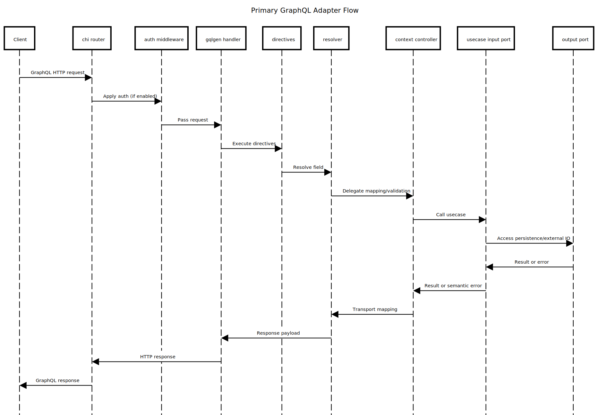

# internal/adapter/primary/graphql

Central GraphQL entrypoint and shared infrastructure for all bounded contexts.

## Purpose and Main Capabilities

- Provide a single GraphQL server, wiring and transport configuration.
- Compose a modular schema shared by all contexts.
- Centralize cross-cutting GraphQL concerns via directives.
- Hold GraphQL transport models generated by gqlgen.

## Package Composition

- `schema/`: GraphQL schema root and module composition.
- `schema/modules/`: context-specific schema modules (category, tag, record, chat, user).
- `directives/`: shared directives (auth and other cross-cutting rules).
- `model/`: gqlgen transport models used by resolvers and controllers.
- `gqlgen.yml`: gqlgen configuration and codegen targets.
- `generated.go`: gqlgen-generated execution code (do not edit).
- `resolver.go`: dependency wiring into thin controllers per context.
- `root.resolvers.go`: base Query/Mutation resolver wiring (gqlgen-managed).
- `*.resolvers.go`: field resolvers per context (category, tag, record, chat, user).
- `server.go`: HTTP handler setup, transports, middleware, directive wiring.
- `tools.go`: tool-only gqlgen dependencies for `go mod tidy`.

## Flow (Where it comes from -> Where it goes)

GraphQL request -> chi router + recovery -> auth middleware -> gqlgen handler ->
directive checks -> resolver -> context controller ->
usecase input port -> output port -> result -> GraphQL response.

## Diagram

Diagram source: `../../../../docs/diagram/internal-adapter-primary-graphql.sequence.txt`

## Why It Was Designed This Way

- Keep schema ownership local to each context while sharing one endpoint.
- Make cross-cutting behavior explicit and reusable via directives.
- Separate transport mapping from business logic through controllers and ports.

## Recommended Practices Visible Here

- Keep schemas in `schema/modules` and avoid monolithic root schemas.
- Keep resolvers thin; delegate to context controllers for mapping and validation.
- Use directives for policy, not copy-pasted checks inside resolvers.
- Treat `generated.go` and `model/models_gen.go` as codegen outputs only.
- Keep directive errors consistent and context-aware (no infra leakage).
- Document directive dependencies in the schema modules that use them.
- Update schema and resolver mappings together when changing GraphQL contracts.

## Differentials

- Single GraphQL surface with modular schemas and shared directives.

## What Should NOT Live Here

- Domain logic, persistence, or infrastructure details.
- Context-specific controllers (they live in `internal/<ctx>/adapter/primary/graphql/controller`).
- Business validation that belongs in usecases.
- Standalone docs in subfolders (documentation is centralized here).
