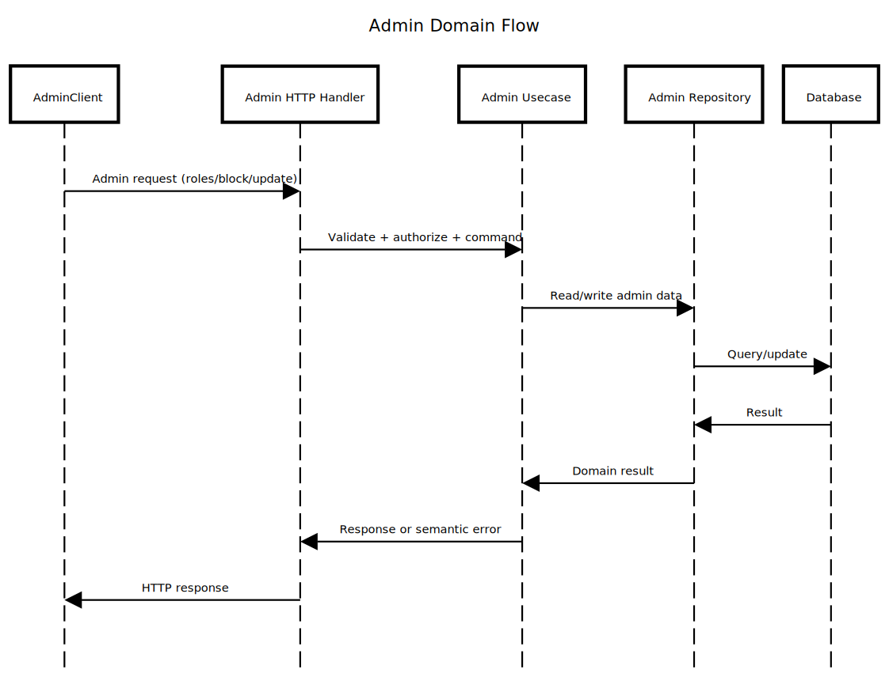

# internal/admin

Administrative domain for privileged operations separated from end-user flows.

## Purpose & Main Capabilities

- Enforce admin-only actions (roles, block/unblock, privileged updates).
- Apply elevated authorization and auditing policies.
- Provide a dedicated boundary for admin behavior and errors.

## Package Composition

- `core/`
  - Admin domain models, ports, and usecases.
- `adapter/`
  - HTTP handlers and persistence adapters for admin workflows.
- `ROLES_ARCHITECTURE.md`
  - Role model structure and intent.
- `ROLES_SUMMARY.md`
  - Quick reference for role behavior.

## Flow (Where it comes from -> Where it goes)

Admin HTTP request -> adapter/primary/http -> core/usecase -> adapter/secondary/db

## Diagram

Source: `../../docs/diagram/internal-admin.sequence.txt`

## Why It Was Designed This Way

- Keep admin permissions isolated from user routes.
- Enforce strict policies at dedicated boundaries.
- Allow auditing and trace correlation for sensitive actions.

## Recommended Practices Visible Here

- Validate admin claims in adapters and re-check in core.
- Emit audit-ready logs with trace correlation.
- Reuse shared ports when it avoids duplicating rules.

## Differentials

- Dedicated admin boundary with explicit role documentation.

## What Should NOT Live Here

- End-user behavior or generic CRUD.
- UI-specific logic or transport DTOs outside adapters.
