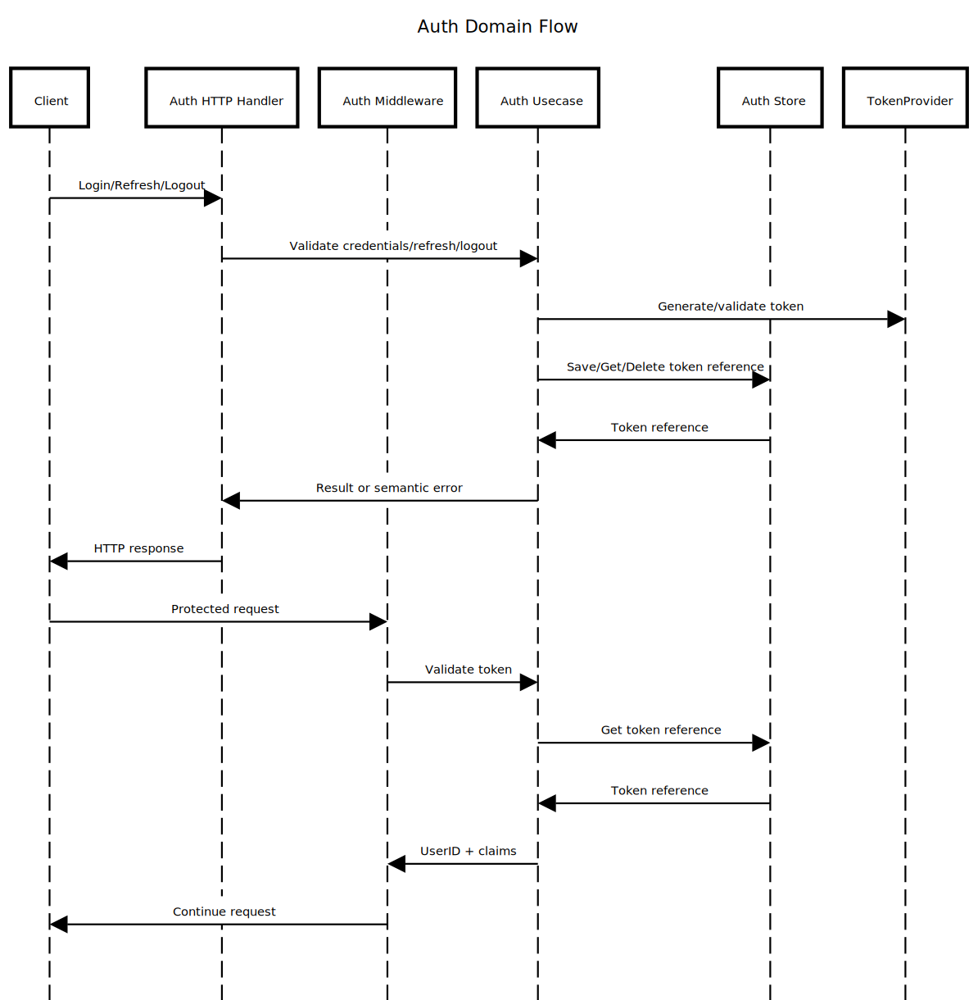

# internal/auth

Authentication and authorization domain for login/logout, token validation, and session/claims handling.

## Purpose & Main Capabilities

- Authenticate users and issue access/refresh tokens.
- Validate tokens and extract claims for downstream handlers.
- Support revocation checks via token storage.

## Package Composition

- `core/`
  - Auth domain rules, ports, and usecases.
- `adapter/`
  - HTTP handlers/middleware and cache adapters.

## Flow (Where it comes from -> Where it goes)

HTTP request -> adapter/primary/http -> core/usecase -> adapter/secondary/cache

## Diagram

Source: `../../docs/diagram/internal-auth.sequence.txt`

## Why It Was Designed This Way

- Keep auth policies isolated from transport and storage.
- Enforce consistent token validation and revocation checks.
- Provide a single source of truth for security flows.

## Recommended Practices Visible Here

- Sanitize bearer tokens and handle cookie fallback.
- Never log credentials or tokens.
- Use semantic errors for invalid credentials or token mismatch.

## Differentials

- Dual token sources (header and cookie) with centralized validation.
- Cache-backed token reference checks for revocation.

## What Should NOT Live Here

- Business logic unrelated to authentication.
- Direct database access from core.
- Transport-specific DTOs outside adapters.
