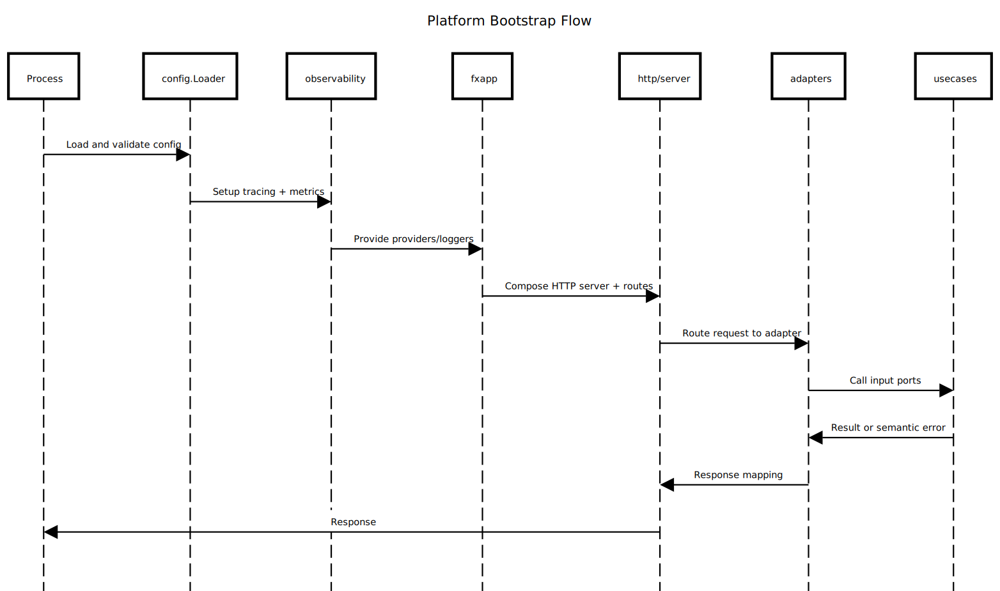

# internal/platform

Cross-cutting platform layer (config, bootstrap/DI, observability, HTTP server) shared by all domains.

## Purpose and Main Capabilities

- Load and validate configuration and build the Fx dependency graph.
- Provide logging, tracing, and metrics primitives.
- Host HTTP/GraphQL servers with routing and middleware.
- Define shared output ports (cache, logger, keygen, hasher, db, httpclient).

## Package Composition

- `config/`: configuration loading and validation.
- `fxapp/`: module wiring and dependency composition.
- `observability/`: tracer and metric setup.
- `server/`: HTTP server, routing, middleware, and utilities.
- `ports/`: cross-cutting output ports consumed by bounded contexts.
- `httpclient/`: shared HTTP client configuration.

Key READMEs:
- `config/README.md`
- `fxapp/README.md`
- `observability/README.md`
- `server/README.md`
- `server/http/README.md`
- `ports/README.md`
- `httpclient/README.md`

## Flow (Where it comes from -> Where it goes)

Process start -> config -> observability -> fxapp modules -> server -> adapters/usecases

## Diagram

Source: `../../docs/diagram/internal-platform.sequence.txt`

## End-to-End Flow (Concise)

- `config` loads env, validates, and normalizes values.
- `observability` bootstraps tracer and metrics providers.
- `fxapp` composes modules and injects dependencies.
- `server/http` composes routes, middlewares, and mounts GraphQL.
- Context adapters use ports to call usecases and repositories.

## Why It Was Designed This Way

- Centralize runtime wiring and avoid duplicated infra code.
- Keep domains isolated from platform concerns.
- Provide consistent observability and HTTP behavior.

## Recommended Practices Visible Here

- Prefer DI via Fx over globals.
- Keep platform free of domain logic.
- Align metrics/tracing with `infrastructure/observability`.
- Keep HTTP utilities generic and reusable.
- Link detailed docs in key subpackages (config, server, observability, ports).

## Differentials

- Single platform layer shared across all bounded contexts.

## What Should NOT Live Here

- Business rules or domain-specific behavior.
- Adapter implementations tied to a single context.
