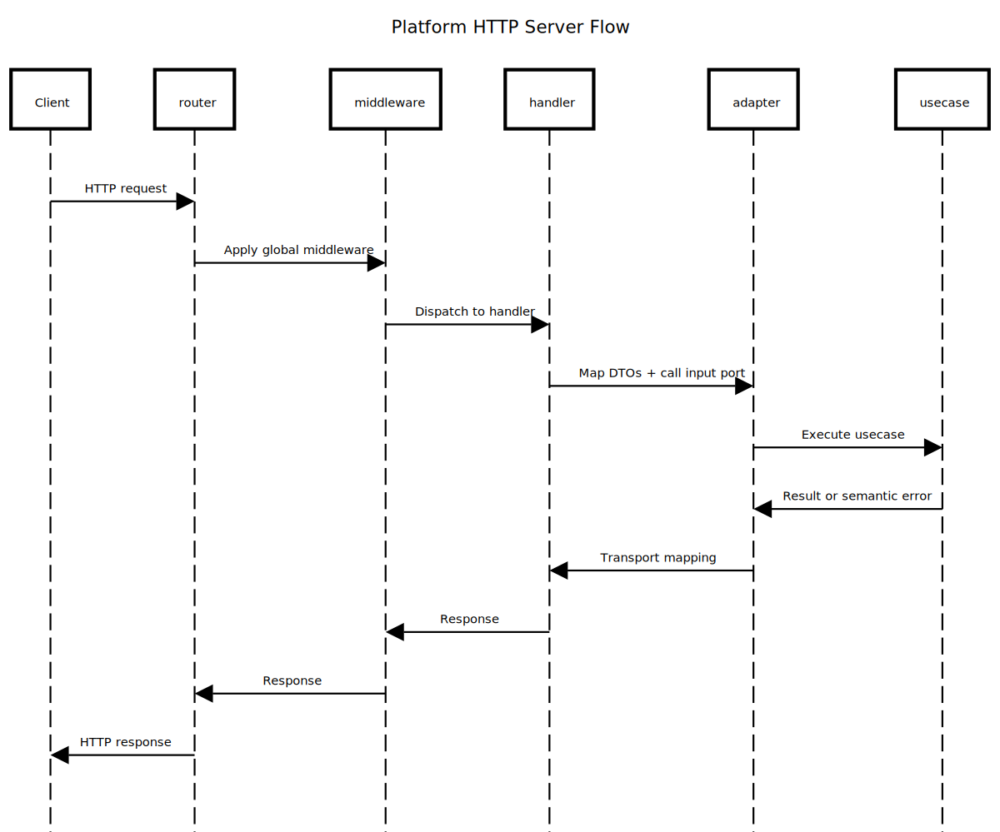

# Platform Server

**Folder:** `internal/platform/server`

## Responsibility

* Provide the platform **transport layer** for HTTP (including GraphQL mounting).
* Own the **router port** (`internal/platform/server/http/ports.Router`) and router adapters.
* Offer **cross-cutting handlers** (health, 404/405, error/recovery) and middleware (request ID, recovery).
* **Compose** primary adapters from each bounded context into one runnable server.

---

## Layout

```
internal/platform/server
└─ http/
   ├─ ports/          # framework-agnostic Router contract
   ├─ router/chi/     # chi implementation of the Router port
   ├─ generic/        # platform handlers (health, 404/405, error)
   ├─ middleware/     # request ID, recovery, cors, service token
   ├─ utils/          # httpresponse, cookies, sharederrors helpers
   ├─ composer.go     # mounts routes from contexts + platform endpoints
   └─ server.go       # HTTP server startup/shutdown
```

## Diagram



Source: `../../../docs/diagram/internal-platform-server.sequence.txt`

---

## How it works

* **Port + Adapter**

    * Contexts depend only on `http/ports.Router`.
    * Swap the underlying router by providing another adapter under `http/router/<impl>`.

* **Composition**

    * `http/composer.go` wires platform endpoints and each context’s **primary HTTP adapter**:

        * mounts **/health** and default **404/405** handlers,
        * calls each context’s `RegisterHTTP(r ports.Router, h *Handler)` (or equivalent),
        * applies platform middlewares (request ID, recovery, cors),
        * mounts everything under `cfg.ServerHTTP.Context` (e.g., `/aion-api`).

* **Server lifecycle**

    * `http/server.go` builds a standard `*http.Server` using timeouts/host/port from `internal/platform/config`.
    * Start/shutdown are wired through Fx lifecycle for graceful shutdown.

* **Observability**

    * Generic handlers and middleware include **OTel spans** and structured logs.
    * Recovery middleware captures panics and returns a consistent 500 response.
    * Request-ID middleware guarantees a `X-Request-ID` header and context value.

---

## Router Port (essentials)

`internal/platform/server/http/ports.Router` exposes a minimal, consistent API:

* `Use(mw ...Middleware)` — apply platform middlewares.
* `Group(prefix string, fn func(ports.Router))` — mount subtrees.
* `GroupWith(mw Middleware, fn func(ports.Router))` — mount protected subtrees.
* `GET/POST/PUT/PATCH/DELETE(path string, h http.HandlerFunc)` — register handlers.
* Setters for **NotFound/MethodNotAllowed** and a central **ErrorHandler**.

> Context adapters must **only** import this port, never a concrete router package.

---

## GraphQL

* The GraphQL HTTP handler is built in `internal/adapter/primary/graphql`.
* The platform mounts that handler alongside REST routes via `http/composer.go`.
* Schema composition and gqlgen generation are driven by `make graphql`.

---

## Conventions

* **Primary adapters stay thin**: decode/validate, call input ports, map responses, standardize errors.
* Always register routes via the **router port**; never import `chi` (or any router) directly from contexts.
* Apply **domain middleware** (e.g., Auth) with `GroupWith` only where required.
* Log **metadata** (request ID, user ID, operation) — avoid sensitive payloads.

---

## Extending

* **New context over HTTP**: create the primary adapter and mount it in `http/composer.go`.
* **New middleware**: implement `ports.Middleware` and add it via `Use` in the composer.
* **Swap router**: implement `ports.Router` under `http/router/<impl>` and switch the binding in the composer.
* **Add GraphQL fields**: drop `.graphqls` in your context module, run `make graphql`, and wire resolvers.

> Keep the server package **framework-agnostic, observable, and composable**.
